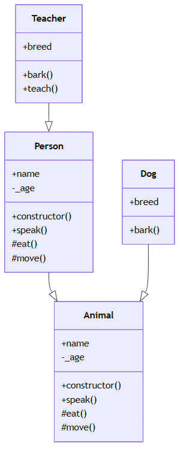
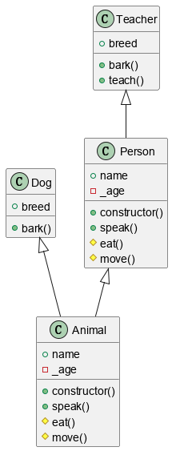

## js2uml
JavaScript 代码转 UML 图工具
## 使用

```
$ node ./src/main.js
Usage:  [options]

JavaScript 代码转 UML 图工具

Options:
  -V, --version        output the version number
  -e, --engine <type>  选择渲染引擎 (mm|puml), mm means mermaid, puml meams plantuml (default: "mm")
  -i, --input <dir>    指定输入目录
  -o, --output <file>  指定输出文件路径
  -h, --help           display help for command
```

### 生成 mermaid example

```
$ node ./src/main.js -i ./example/ -o ./output/example.html
```


### 生成 plantuml example

```
$ node ./src/main.js -e puml -i ./example/ -o ./output/example.puml
```
**注意：生成 plantuml 图表，需要下载 plantuml.jar 支持**


[官网下载地址](https://plantuml.com/zh/download)
[plantuml使用指南](https://plantuml.com/zh/gui)

## 遇到的问题

### mermaid 显示超过最大节点数，无法显示问题

> error: Maximum Text Size in Diagram exceeded

```
mermaid.initialize({
	startOnLoad: true,
	maxTextSize: 90000, // 增加此属性，根据具体情况修改数值
})
```

plantUML 生成图片内容显示不全问题：

java -DPLANTUML_LIMIT_SIZE=40960 -jar plantuml-gplv2-1.2025.2.jar -gui

reference: https://knowledge.zhaoweiguo.com/build/html/x-design/plantumls/question